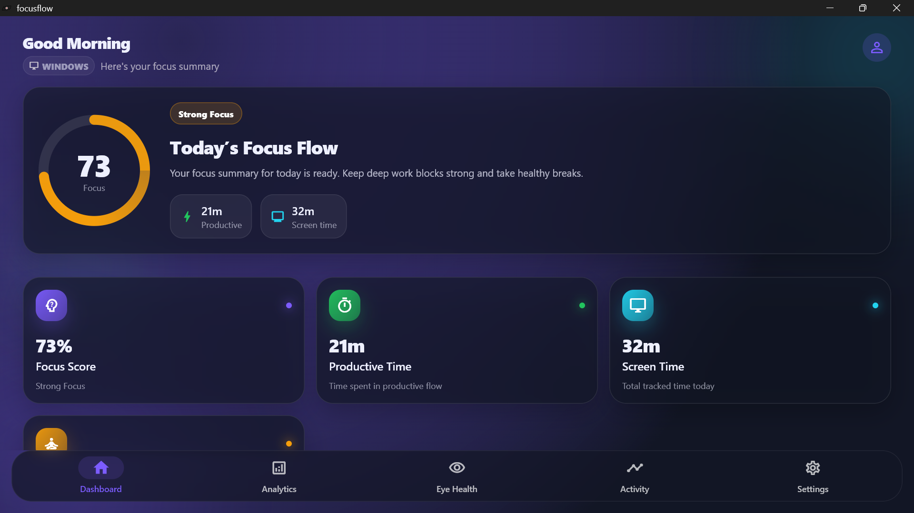
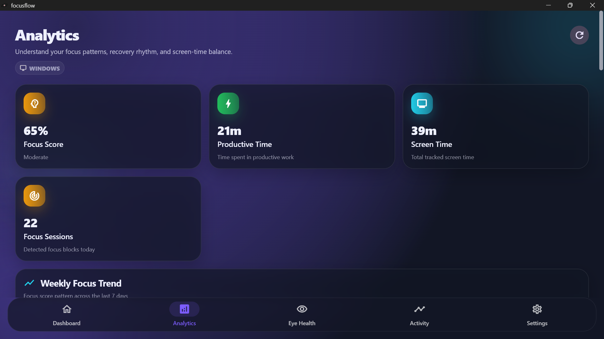
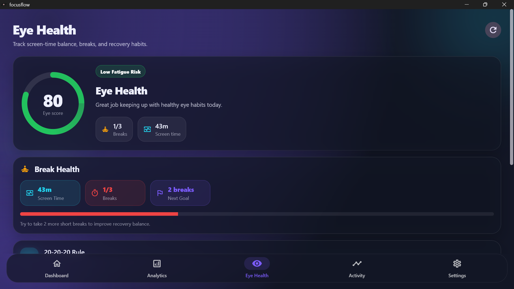
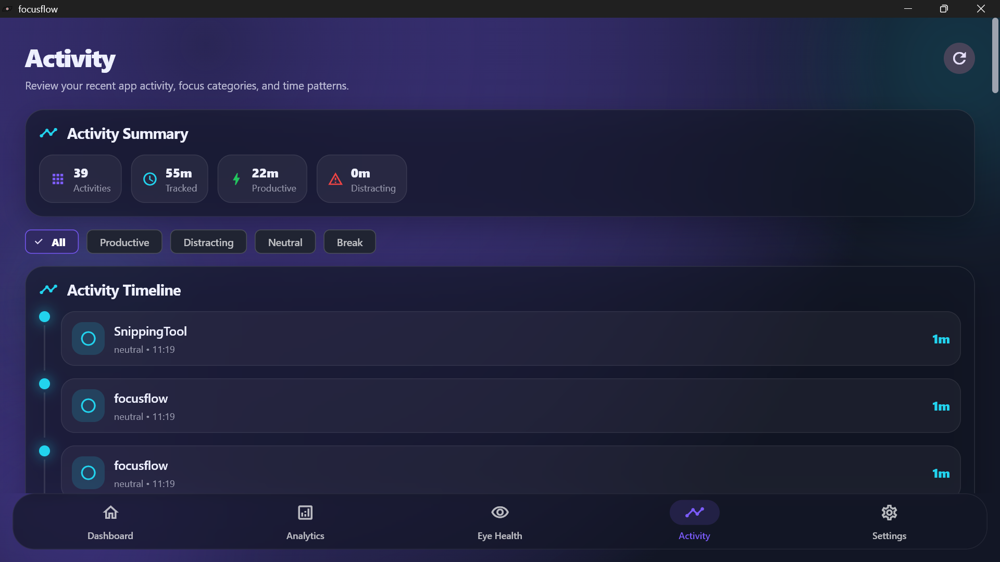
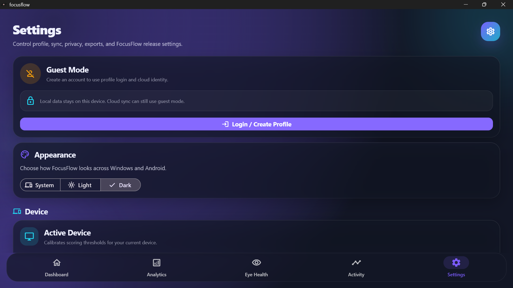
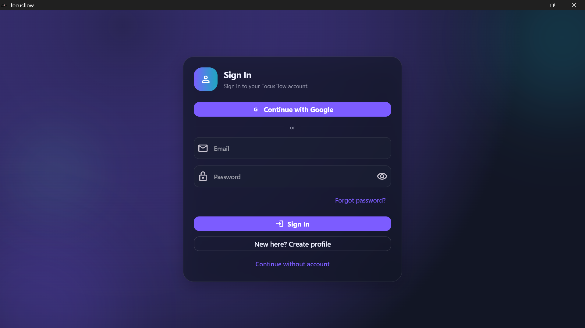

<div align="center">


# FocusFlow

### Focus better. Rest smarter. Build healthier digital habits.

A cross-device digital wellness and productivity platform built with **Flutter** and **Dart**.

<br />

<a href="https://www.linkedin.com/in/anant-jodha/">
  
</a>
<a href="#features">
  
</a>
<a href="#getting-started">
  
</a>

<br /><br />


<br />








</div>

---

## About the project

**FocusFlow** is a digital wellness and productivity application designed to help people work with greater focus while protecting their long-term screen health.

The platform tracks uninterrupted work sessions, application switching, deep-work periods, screen exposure, recovery patterns, and break behaviour. These signals are transformed into understandable metrics such as a **Focus Score**, **Recovery Score**, and **Eye Health Score**.

Unlike traditional productivity tools that rely on frequent alerts, FocusFlow follows a calm and non-disruptive approach. Its reminder system is designed to recognise deep work and delay non-urgent interruptions until a more suitable moment.

FocusFlow is being developed from a single Flutter codebase for **Windows, Android, tablet, and web**, with platform-specific scoring thresholds and activity-monitoring capabilities.

> **Core principle:** Assist silently, never interrupt aggressively.

## Features

### Focus and productivity

* Track uninterrupted focus sessions
* Measure deep-work duration
* Detect application switching
* Identify distracting activity patterns
* Analyse productive and unproductive screen time
* Display daily focus scores and performance summaries
* Break work into understandable attention-flow stages

### Attention-flow analysis

FocusFlow models a work session as a sequence of attention states:

```text
Deep Work → Distraction → Recovery
```

This makes it possible to analyse not only how often a user becomes distracted, but also how effectively they return to productive work.

Planned attention-flow metrics include:

* Distraction frequency
* Average recovery time
* Deep-work continuity
* Context-switching intensity
* Focus stability
* Recovery efficiency

### Eye-health system

* Monitor continuous screen exposure
* Track compliance with the 20-20-20 rule
* Estimate digital-eye-strain risk
* Measure time since the last meaningful visual break
* Present daily eye-health scores
* Encourage healthier screen habits without aggressive interruption
* Support adaptive reminders based on current activity

### Adaptive reminders

* Avoid interrupting active deep-work sessions
* Recommend breaks at contextually appropriate moments
* Adjust reminder timing using recent activity
* Reduce unnecessary or repeated notifications
* Support calm, lightweight wellness prompts
* Balance productivity with physical recovery

### Cross-device experience

* Shared Flutter codebase
* Platform-calibrated scoring thresholds
* Responsive layouts for desktop, tablet, mobile, and web
* Consistent FocusFlow visual language across devices
* Planned Firebase synchronization
* Planned unified productivity history across platforms

### Privacy-first design

* Local-first data storage
* No cloud dependency during the initial development phases
* User-controlled cloud synchronization
* On-device activity processing where possible
* Cloud sync remains optional
* Personal activity data is not uploaded unless the user enables synchronization

## Productivity dashboard

The dashboard brings the most important wellness and productivity signals into one place.

| Metric             | Purpose                                                      |
| ------------------ | ------------------------------------------------------------ |
| Focus Score        | Summarises focus quality and uninterrupted work              |
| Recovery Score     | Measures how effectively attention returns after distraction |
| Eye Health Score   | Estimates healthy screen-use behaviour                       |
| Deep Work          | Shows time spent in sustained productive activity            |
| Screen Time        | Tracks total active screen exposure                          |
| Break Compliance   | Measures whether recommended recovery breaks were taken      |
| Activity Breakdown | Groups time by productive, neutral, and distracting activity |

## Tech stack

| Layer                   | Technology                                    |
| ----------------------- | --------------------------------------------- |
| Language                | Dart                                          |
| Framework               | Flutter                                       |
| Interface               | Flutter Material components                   |
| Local database          | SQLite                                        |
| Cloud database          | Cloud Firestore — planned for Phase 5         |
| Authentication          | Firebase Authentication — planned for Phase 5 |
| State and services      | Flutter service-based architecture            |
| Analytics               | Custom FocusFlow scoring engine               |
| Charts                  | Flutter chart components                      |
| Windows monitoring      | Native Windows activity integration — planned |
| Android monitoring      | UsageStats API integration — planned          |
| Development environment | Visual Studio Code                            |
| Version control         | Git and GitHub                                |

## Supported platforms

| Platform | Status     | Notes                                                |
| -------- | ---------- | ---------------------------------------------------- |
| Windows  | ✅ Active   | Primary development and activity-monitoring platform |
| Android  | 🔜 Phase 5 | Mobile activity tracking and synchronization         |
| Tablet   | 🔜 Phase 5 | Responsive productivity and wellness dashboard       |
| Web      | 🔜 Phase 5 | Browser-based dashboard and synchronized insights    |

## Project structure

```text
FocusFlow/
├── assets/
│   ├── icons/
│   │   └── focusflow_logo_1.png
│   ├── screenshot/
│   │   ├── s1.png
│   │   ├── s2.png
│   │   ├── s3.png
│   │   ├── s4.png
│   │   ├── s5.png
│   │   └── s6.png
│   └── video/
│       └── v1.mp4
│
├── lib/
│   ├── analytics/
│   │   ├── focus_score_engine.dart
│   │   ├── focus_metrics.dart
│   │   ├── eye_health_metrics.dart
│   │   └── app_classifier.dart
│   │
│   ├── models/
│   │   ├── focus_input.dart
│   │   ├── focus_score_result.dart
│   │   ├── activity_record.dart
│   │   └── recovery_metric.dart
│   │
│   ├── screens/
│   │   ├── dashboard_screen.dart
│   │   ├── eye_health_screen.dart
│   │   ├── analytics_screen.dart
│   │   ├── activity_screen.dart
│   │   └── settings_screen.dart
│   │
│   ├── services/
│   │   ├── settings_service.dart
│   │   ├── activity_service.dart
│   │   ├── mock_focus_data.dart
│   │   └── storage_service.dart
│   │
│   ├── theme/
│   │   └── focusflow_theme.dart
│   │
│   └── main.dart
│
├── test/
│   └── ...
│
├── pubspec.yaml
├── analysis_options.yaml
├── LICENSE
└── README.md
```

## Architecture

FocusFlow separates interface code, analytics logic, application models, and data services.

### Analytics layer

The analytics layer transforms raw activity data into productivity and wellness metrics.

```text
Activity records
      ↓
App classification
      ↓
Focus and eye-health metrics
      ↓
Scoring engine
      ↓
Dashboard insights
```

Important analytics components include:

| Component                 | Responsibility                             |
| ------------------------- | ------------------------------------------ |
| `focus_score_engine.dart` | Calculates the overall focus score         |
| `focus_metrics.dart`      | Derives productivity and attention metrics |
| `eye_health_metrics.dart` | Calculates screen-health and break metrics |
| `app_classifier.dart`     | Classifies applications by activity type   |

### Model layer

The model layer defines structured data used throughout the application.

| Model              | Purpose                                     |
| ------------------ | ------------------------------------------- |
| `FocusInput`       | Input values supplied to the scoring engine |
| `FocusScoreResult` | Calculated score and supporting breakdown   |
| `ActivityRecord`   | A recorded application or focus activity    |
| `RecoveryMetric`   | Recovery information following distraction  |

### Service layer

Services connect the interface to data, settings, storage, and activity records.

| Service           | Purpose                                      |
| ----------------- | -------------------------------------------- |
| `SettingsService` | Stores and retrieves application preferences |
| `ActivityService` | Supplies activity records to the interface   |
| `MockFocusData`   | Provides temporary development data          |
| `StorageService`  | Handles local persistence                    |

## Development roadmap

| Phase | Status     | Description                                                      |
| ----- | ---------- | ---------------------------------------------------------------- |
| 1     | ✅ Complete | UI foundation, application screens, scoring engine, and theme    |
| 2     | 🔄 Active  | Real Windows activity tracking and monitoring                    |
| 3     | ⬜ Planned  | Attention-flow analytics and recovery scoring                    |
| 4     | ⬜ Planned  | Adaptive reminder intelligence                                   |
| 5     | ⬜ Planned  | Android, tablet, web, Firebase, and cross-device synchronization |

### Phase 1 — UI foundation

Completed work includes:

* Main application screens
* FocusFlow visual theme
* Dashboard cards and charts
* Focus scoring foundation
* Eye-health interface
* Activity interface
* Settings experience
* Mock data integration

### Phase 2 — Windows activity tracking

Current development focuses on:

* Detecting the active application
* Recording app-use duration
* Tracking application switching
* Producing activity records
* Categorising applications
* Connecting real activity data to the dashboard

### Phase 3 — Focus analytics

Planned work includes:

* Attention-flow detection
* Deep-work identification
* Distraction-event detection
* Recovery-time measurement
* Recovery score calculation
* Historical focus trends

### Phase 4 — Reminder intelligence

Planned work includes:

* Adaptive break recommendations
* Deep-work-aware notification timing
* Eye-health risk alerts
* Reminder cooldown logic
* User-specific reminder thresholds

### Phase 5 — Cross-device sync

Planned work includes:

* Android support
* Tablet layouts
* Web deployment
* Firebase Authentication
* Cloud Firestore
* Cross-device metric synchronization
* User-controlled cloud backup

## Data-source roadmap

FocusFlow is being developed incrementally so that the interface, analytics engine, and operating-system integrations can be tested independently.

| Stage | Status     | Description                                              |
| ----- | ---------- | -------------------------------------------------------- |
| 1     | ✅ Complete | Hardcoded values for initial interface development       |
| 2     | 🔄 Active  | Mock activity records supplied through `ActivityService` |
| 3     | ⬜ Planned  | Persistent local storage with SQLite                     |
| 4     | ⬜ Planned  | Automatic OS monitoring with Win32 and UsageStats APIs   |
| 5     | ⬜ Planned  | Real-time metrics calculated from live activity data     |

```text
Hardcoded values
      ↓
Mock activity records
      ↓
SQLite persistence
      ↓
Operating-system monitoring
      ↓
Live productivity metrics
```

## Scientific foundation

FocusFlow is informed by research into digital eye strain, ergonomic computing, cognitive fatigue, and attention recovery.

### Digital eye strain

Extended screen exposure may contribute to symptoms commonly associated with digital eye strain, including:

* Dry or irritated eyes
* Blurred vision
* Difficulty refocusing
* Headaches
* Neck and shoulder discomfort
* General visual fatigue

FocusFlow uses screen duration and break behaviour to help users recognise potentially unhealthy patterns.

### The 20-20-20 rule

The application supports the commonly recommended 20-20-20 practice:

> Every 20 minutes, look at something approximately 20 feet away for at least 20 seconds.

FocusFlow is designed to track this behaviour without forcing users out of important work.

### Cognitive fatigue and recovery

Productivity is not determined only by uninterrupted work duration. The ability to recover after distraction is also important.

FocusFlow therefore considers:

* How frequently attention is interrupted
* How long distractions continue
* How quickly productive work resumes
* Whether repeated task switching reduces focus stability
* Whether breaks improve later focus performance

### Ergonomic computing

The broader FocusFlow wellness model is intended to encourage:

* Regular visual breaks
* Sustainable work sessions
* Reduced uninterrupted screen exposure
* Healthier posture awareness
* Balanced periods of work and recovery

> FocusFlow provides wellness insights and is not a medical diagnostic tool.

## Getting started

### Requirements

Before running the project, install:

* Flutter SDK
* Dart SDK, included with Flutter
* Git
* Visual Studio Code or Android Studio
* Platform-specific Flutter development tools

Verify your Flutter installation:

```bash
flutter doctor
```

Resolve any required platform dependencies reported by Flutter before continuing.

### Clone the repository

```bash
git clone https://github.com/AnantJodhaRathore/focusflow.git
cd focusflow
```

### Install dependencies

```bash
flutter pub get
```

### Run on Windows

```bash
flutter config --enable-windows-desktop
flutter run -d windows
```

### Run on Android

Start an Android emulator or connect a physical device, then run:

```bash
flutter devices
flutter run -d android
```

Android support is part of the planned Phase 5 release. Some features may remain unavailable until the platform-specific monitoring service is implemented.

### Run on the web

```bash
flutter config --enable-web
flutter run -d chrome
```

Web support is planned for Phase 5 and may not yet provide the full desktop activity-tracking experience.

## Build the application

### Windows release build

```bash
flutter build windows
```

The generated application will normally be available under:

```text
build/windows/x64/runner/Release/
```

### Android release build

```bash
flutter build apk --release
```

For an Android App Bundle:

```bash
flutter build appbundle --release
```

### Web release build

```bash
flutter build web
```

## Run tests

Run the Flutter test suite with:

```bash
flutter test
```

Run static analysis with:

```bash
flutter analyze
```

Format the Dart source code with:

```bash
dart format lib test
```

## Local data and privacy

FocusFlow follows a local-first approach.

During the initial development phases:

* Activity data remains on the device
* Settings are stored locally
* Cloud synchronization is disabled
* No user account is required
* Productivity metrics are calculated locally

Firebase and Firestore integration is planned for Phase 5. Cloud synchronization will only be used after the user chooses to enable it.

## Demo

<div align="center">

<video src="assets/video/v1.mp4" controls width="800">
  Your browser does not support the video element.
</video>

</div>

> GitHub README pages may not play embedded video files in every browser. Consider adding a preview image linked to the video or uploading the demonstration to a supported video platform.

## Troubleshooting

### Flutter does not detect Windows

Confirm that Windows desktop support is enabled:

```bash
flutter config --enable-windows-desktop
flutter devices
```

Then review the Windows section of:

```bash
flutter doctor
```

### Dependencies cannot be resolved

Refresh the package installation:

```bash
flutter clean
flutter pub get
```

If required, update compatible package versions in `pubspec.yaml`.

### No Android device is available

List available devices:

```bash
flutter devices
```

Start an emulator through Android Studio or connect a physical Android device with USB debugging enabled.

### Visual Studio Code shows Dart errors

Confirm that:

* The Flutter extension is installed
* The Dart extension is installed
* The correct project directory is open
* `flutter pub get` has completed successfully
* The Flutter SDK path is configured correctly

### Application data needs to be reset

During early development, local data can be reset by clearing the application storage or removing the generated development database.

The exact storage location may differ by platform.

## Future improvements

* Real-time Windows application monitoring
* Android UsageStats integration
* Persistent SQLite activity history
* Attention-flow visualisation
* Recovery-score analytics
* Intelligent break scheduling
* Custom application categories
* Weekly and monthly wellness reports
* User-defined focus goals
* Cross-device synchronization
* Firebase Authentication
* Cloud Firestore integration
* Exportable productivity reports
* Accessibility improvements
* Notification controls
* Optional encrypted cloud backup

## Contributing

Contributions, suggestions, and issue reports are welcome.

To contribute:

1. Fork the repository.
2. Create a focused feature branch.
3. Make and test your changes.
4. Commit the changes with a clear message.
5. Push the branch to your fork.
6. Open a pull request.

```bash
git checkout -b feature/your-feature
git add .
git commit -m "Add your feature"
git push origin feature/your-feature
```

Please keep contributions aligned with FocusFlow’s core principles:

* Calm rather than disruptive
* Privacy-first
* Lightweight
* Evidence-informed
* Accessible across devices
* Helpful without becoming intrusive

---

<div align="center">

### Work with focus. Recover with intention.

FocusFlow is built for people who want technology to support their attention—not compete for it.

</div>

## Connect with me

<div align="center">

### Anant Jodha Rathore

<a href="https://www.linkedin.com/in/anant-jodha/">
  
</a>

</div>

---

## License

This project is licensed under the [MIT License](LICENSE).
