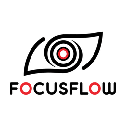

<div align="center">

# FocusFlow



**A cross-device digital wellness and productivity platform built with Flutter.**

FocusFlow helps users maintain healthy screen habits, reduce eye strain, improve focus,
and build sustainable work routines — across Windows, Android, Tablet, and Web from a single codebase.


</div>

---

## What it does

| Feature | Description |
|---|---|
| **Focus tracking** | Uninterrupted work sessions, app switching, and deep work blocks |
| **Eye health system** | 20-20-20 rule compliance, fatigue risk, and screen time monitoring |
| **Attention flow** | Deep Work → Distraction → Recovery detection |
| **Adaptive reminders** | Smart break timing that avoids interrupting deep work |
| **Cross-device scoring** | Platform-calibrated thresholds for Windows, Android, Tablet, and Web |
| **Productivity dashboard** | Focus score, recovery score, eye health score, and breakdown charts |

---

## Tech stack

| Component | Technology |
|---|---|
| Language | Dart |
| Framework | Flutter |
| IDE | Visual Studio Code |
| Backend | Firebase *(Phase 5)* |
| Database | SQLite + Firestore |
| Charts | Flutter Charts |
| Version control | GitHub |

---

## Supported platforms

| Platform | Status |
|---|---|
| Windows | ✅ Active |
| Android | 🔜 Phase 5 |
| Tablet | 🔜 Phase 5 |
| Web | 🔜 Phase 5 |

---

## Development roadmap

| Phase | Status | Description |
|---|---|---|
| 1 | ✅ Complete | UI foundation — all screens, scoring engine, theme |
| 2 | 🔄 Active | Activity tracking — real Windows monitoring |
| 3 | ⬜ Planned | Focus analytics — attention flow, recovery score |
| 4 | ⬜ Planned | Reminder intelligence — adaptive break timing |
| 5 | ⬜ Planned | Cross-device sync — Firebase and Firestore |

## Data sources roadmap

| Stage | Status | Description |
|---|---|---|
| 1 | ✅ Complete | Hardcoded mock values |
| 2 | 🔄 Active | Mock activity records via `ActivityService` |
| 3 | ⬜ Planned | Local SQLite database |
| 4 | ⬜ Planned | Automatic OS monitoring (Win32 / UsageStats API) |
| 5 | ⬜ Planned | Real-time metrics engine on live data |

---

## Architecture

```
lib/
├── analytics/          # Scoring engine, metrics, app classifier
│   ├── focus_score_engine.dart
│   ├── focus_metrics.dart
│   ├── eye_health_metrics.dart
│   └── app_classifier.dart
│
├── models/             # Data models
│   ├── focus_input.dart
│   ├── focus_score_result.dart
│   ├── activity_record.dart
│   └── recovery_metric.dart
│
├── screens/            # UI screens
│   ├── dashboard_screen.dart
│   ├── eye_health_screen.dart
│   ├── analytics_screen.dart
│   ├── activity_screen.dart
│   └── settings_screen.dart
│
├── services/           # Data and state services
│   ├── settings_service.dart
│   ├── activity_service.dart
│   ├── mock_focus_data.dart
│   └── storage_service.dart
│
├── theme/
│   └── focusflow_theme.dart
│
└── main.dart
```

---

## Scientific foundation

FocusFlow is grounded in peer-reviewed research:

- **Digital Eye Strain (DES)** — Mark Rosenfield, SUNY College of Optometry,
  research on computer vision syndrome
- **20-20-20 rule** — Every 20 minutes, look 20 feet away for 20 seconds
- **Ergonomic computing** — workspace and posture guidelines for screen-intensive work
- **Cognitive fatigue research** — Human-Computer Interaction studies on attention and recovery

---

## Core principle

> Assist silently, never interrupt aggressively.

FocusFlow is calm, lightweight, and privacy-focused.
All data is stored locally on-device until the user opts into cloud sync in Phase 5.

---

## Getting started

```bash
# Clone the repository
git clone https://github.com/YOUR_USERNAME/focusflow.git
cd focusflow

# Install dependencies
flutter pub get

# Run on Windows
flutter run -d windows

# Run on Android
flutter run -d android
```

> Anant Jodha Rathore

---

## License

[MIT](LICENSE)
